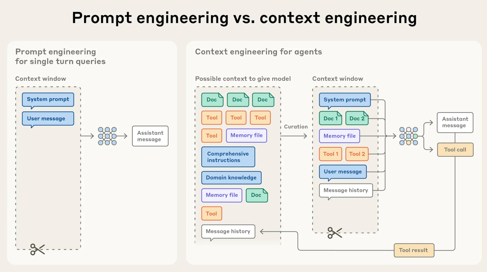
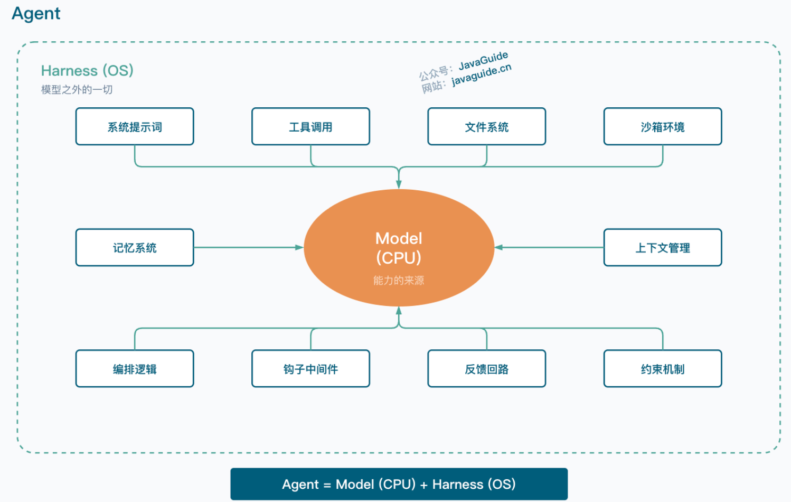
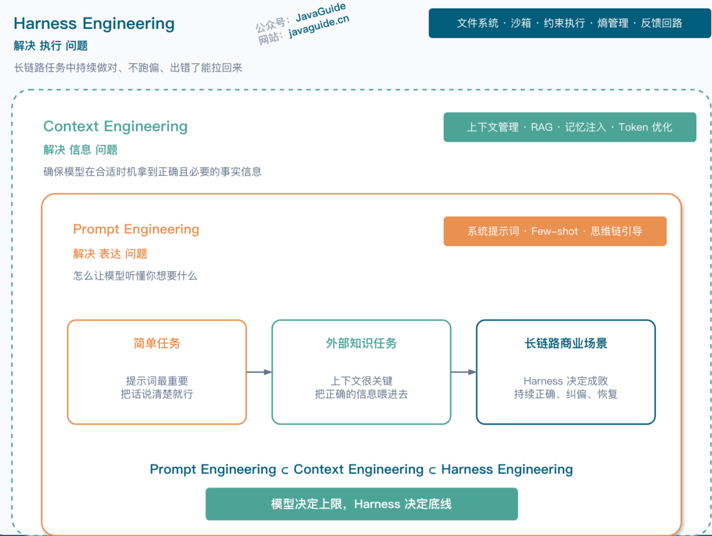
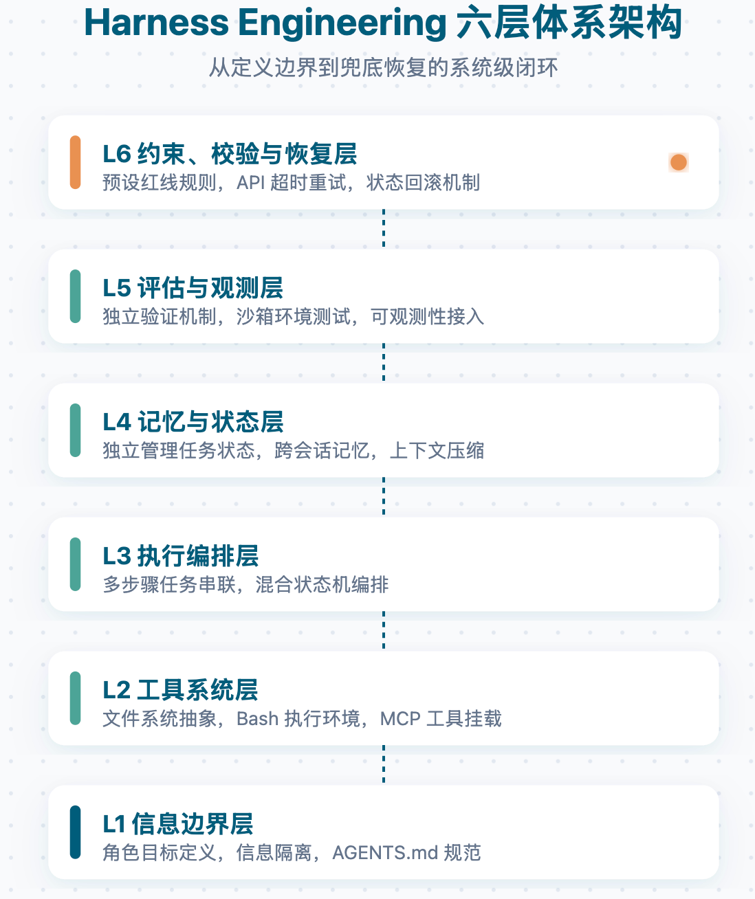

context engineering就是LLM的内存管理，窗口满了就得淘汰内容
上下文窗口就是一块有限内存。Context Engineering 管的是这块内存里装什么、换出什么、什么时候读、什么时候写

Prompt Engineering 关注指令怎么写清楚，Context Engineering 关注什么信息在什么时机进入模型窗口
Prompt engineering vs. context engineering

Prompt 决定模型收到什么指令，Context 决定模型实际看到什么世界。 Agent 一旦进入多轮工具调用，后者往往更重要

Prompt 是用户这次要做什么；Function Calling 是模型怎么发起工具调用；MCP 是把文件、数据库、GitHub 这类外部能力接进来；Skills 则是把一类任务的流程、规则和经验沉淀下来，让 Agent 需要时再读。

## MCP
MCP 的思路是：工具提供方把能力封成 MCP Server，AI 应用只要支持 MCP Client，就可以按统一方式发现和调用这些能力。

前端不用知道后端内部怎么查库，后端也不用关心前端页面怎么渲染，双方通过接口契约协作。MCP 也是类似思路：Agent 开发关注任务和交互，工具开发关注能力和边界，中间用协议连接。

MCP 先解决工具接入这块的重复适配问题。

RESTful API 统一了 Web 服务的接口风格，MCP 想统一的是 AI 应用与外部工具/数据源的接入方式。

Function Calling 是“模型怎么表达要调工具”，MCP 是“工具怎么接入宿主”，Skills 是“Agent 做这类任务时按什么经验执行”。三者不是替代关系，而是不同层次的组合。

## Harness Engineering
不要把 Agent 表现完全归因于模型本身，模型之外的任务管理、上下文供给、工具反馈、验证机制、错误恢复，同样决定系统上限。

- Agent = Model + Harness。模型负责推理和生成，Harness 负责把任务、上下文、工具和反馈组织起来。
- Harness 里的每个组件，本质上都编码了一个假设：模型单独做不好什么。
- 模型能力升级后，Harness 也要重新评估。有些过去必要的补丁，可能会变成新的复杂度。
- 上下文污染、代码熵积累、工具调用可靠性，是一线 Agent 工程里很常见的三类问题。

可以把模型想成 CPU，把 Harness 想成操作系统。CPU 再强，OS 如果天天崩，体验也不会好。你买了最新的 M5 芯片，但系统卡死、驱动乱飞，实际体验可能还不如旧芯片配一个稳定系统。

把这些“模型做不了，但你又希望 Agent 能做到”的部分补齐，就是 Harness 的组件清单。LangChain 也把它拆成了几块：文件系统负责持久化，Bash 执行负责通用工具，沙箱负责隔离风险，记忆机制负责跨会话积累，上下文压缩负责对抗长上下文带来的质量下降。

可以把它想成给一个新员工搭工作环境。L1 是岗位说明，告诉他该关注什么；L2 是办公工具；L3 是标准操作流程；L4 是项目管理系统和笔记本；L5 是质检流程；L6 是红线规则和应急预案。

渐进式披露：
OpenAI 的 `AGENTS.md` 大约只有 100 行，作用更像目录，指向 docs/ 目录下更深层的设计文档、架构图、执行计划和质量评级。这就是渐进式披露：先给最关键的信息，需要更多细节时再加载。
这和到一个新城市很像。你不需要一上来背完整本旅游指南，先给一张地图，再告诉你想了解某个景点时去翻哪一页，就够用了
