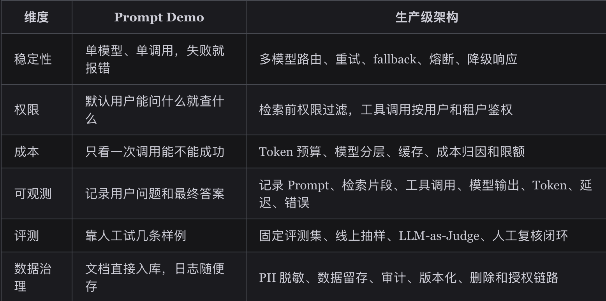

# AI应用架构
你要能把 AI 应用拆成多个工程模块，而不是只说“前端发请求，后端调模型”。

keypoint：
1. Prompt Demo 证明的是模型能回答，生产系统要证明的是系统能长期、稳定、可控地回答。
2. 入口层负责鉴权、租户、限流、参数校验和请求分类。
3. 编排层负责判断任务类型，是普通问答、RAG、Agent、多工具任务，还是异步批处理。
4. Prompt/Context 层负责模板版本、变量校验、历史消息、检索证据、用户画像和工具说明。
5. RAG 管共享知识，Memory 管个性化长期事实，Tool 管真实业务动作，三者要分开治理。
6. 模型网关负责供应商适配、路由、fallback、限流、熔断、Token 预算、成本归因和观测。
7. 评测观测层负责 Trace、日志、指标、Golden Set、LLM-as-Judge、灰度和回放。

回答“怎么设计生产级 AI 应用”时，可以用一个通用模板：先说明业务目标和约束，再讲分层架构，然后讲一次请求链路，接着讲稳定性、安全、成本、观测和评测，最后讲灰度和回滚。这样比直接报一堆技术名词更有说服力。

## Demo架构为什么扛不住生产流量

AI 应用的复杂度来自一个很特殊的事实：核心决策逻辑有一部分交给了概率模型。传统后端里的 if-else 逻辑虽然也会出错，但你能定位到具体代码行；LLM 出错时，原因可能是 Prompt 版本、上下文顺序、检索噪声、工具描述、模型采样、权限过滤、输出解析中的任何一环。

所以，生产级 AI 架构要做的事，是把模型周边的输入、执行、输出和反馈全部工程化。

## 面试怎么讲
面试官问“你怎么设计一个生产级 AI 应用”，别上来就说“我会用 LangChain”。

更稳的回答方式是：

1. 先讲 Demo 和生产差距：稳定性、权限、成本、观测、评测、数据治理。
2. 再讲分层：入口层、编排层、Prompt/Context、RAG/Memory/Tool、模型网关、异步任务、评测观测。
3. 讲关键链路：一次请求如何鉴权、检索、组装上下文、调用模型、校验输出、记录 Trace。
4. 讲治理能力：Prompt 版本、模型 fallback、Token 预算、工具权限、PII 脱敏。
5. 最后讲评测闭环：固定样本集、线上失败样本回放、LLM-as-Judge 和人工复核结合。

## 总结
1. Prompt Demo 只证明“能回答”，生产级架构要证明“长期可控地回答”。
2. 模型网关是 AI 应用基础设施，负责路由、fallback、限流、熔断、Token 预算和成本归因。
3. Prompt 必须版本化，支持变量校验、灰度、回滚和审计。
4. RAG、Memory、Tool 要分开治理，共享知识、个性化记忆和真实业务动作不能混成一团。
5. 可观测和评测决定系统能不能持续变好，没有 Trace 和回放，优化基本靠猜。
6. 安全策略要靠代码强制执行，Prompt 只能辅助，不能替代权限、脱敏、审计和二次确认。
--- 
1. Prompt Demo 到生产系统最大的差距是什么？

核心差距在工程治理。Demo 关注模型能不能答，生产系统关注稳定性、权限隔离、成本控制、可观测、评测回放和数据合规。

2. 为什么需要模型网关？

模型网关把供应商差异、模型路由、fallback、限流、熔断、Token 预算、成本统计和观测统一起来，避免业务代码直接耦合某个模型 API。

3. 同步、流式、异步怎么选？

短小任务走同步，长答案和聊天走流式，报告生成、批量处理、多工具任务走异步。核心判断是任务耗时、用户是否需要首字反馈、是否需要重试和恢复。

4. Prompt 为什么要做版本管理？

Prompt 会直接影响输出质量、工具调用、检索策略和成本。版本管理可以支持灰度、回滚、审计和离线评测回放。

5. Tool Calling 的安全边界在哪里？

模型只能提出工具调用意图，参数校验、权限校验、敏感操作确认和审计必须由后端系统完成。

6. RAG 和 Memory 有什么区别？

RAG 管共享知识源，例如企业文档和产品手册；Memory 管个性化长期事实，例如用户偏好和历史决策。二者可以协作，但要分区注入上下文，避免污染。

7. AI 应用可观测要看哪些指标？

至少看 Prompt 版本、检索命中、工具调用、模型输出、输入输出 Token、TTFT、总延迟、成功率、错误率、成本和评测分数。

8. LLM-as-Judge 能不能替代人工评测？

不能。它适合自动化回归、线上抽样和大规模初筛，但关键业务仍需要规则校验、人工复核和用户反馈闭环。

