# RAG优化：从召回、重排到上下文工程的系统调优
RAG 效果差时，不要一上来就改 Prompt。先判断问题发生在哪一段：没有召回正确证据、召回了但排得太后、放进上下文的内容太吵、模型没有正确使用证据，还是评测样本不稳定。

key point：
1. Hybrid Search 结合关键词检索和向量检索，适合专业术语、编号、实体名、语义表达混杂的场景。
2. Query Rewrite 解决用户问题表达不规范、口语化、多意图、缩写和上下文省略问题。
3. Rerank 负责在候选结果里重新排序，解决向量相似度不等于答案相关性的问题。
4. 上下文压缩可以降低噪声和成本，但压缩错误会丢失关键证据。
5. RAG 优化必须基于失败样本集，不能只拿几条主观案例反复调。

推荐的排查顺序是：先看正确文档是否进入候选池，再看排序位置是否靠前，再看上下文是否被截断或污染，最后看模型是否忠实使用证据。这样能避免把检索问题误判成 Prompt 问题。

RAG 优化的第一条经验是：它本质上是数据、切分、索引、召回、重排、上下文、生成、评估共同组成的系统工程，不是单点调参。

## RAG优化到底在优化什么
RAG 更像一条证据加工流水线：原始资料先被解析、清洗、切块、打标签、建索引；用户问题进来后，再经过查询理解、召回、重排、上下文构建，最后才交给 LLM 生成答案。

RAG 优化的目标是提高最终答案的可用性、可追溯性和稳定性，而不是让每个环节看起来高级

一个粗暴但好用的判断标准：
1. 用户问的问题，正确证据有没有被召回？
2. 正确证据有没有排在足够靠前的位置？
3. 放进上下文的内容是否足够少、足够准？
4. 模型有没有严格基于证据回答？
5. 每次改动有没有通过固定样本集验证？

## RAG优化闭环
这张图的关键不是流程本身，而是两个字：回放。
每次调整 Chunk 大小、重写策略、Rerank 模型、Top-K 参数，都应该拿同一批问题跑一遍，比较 Context Recall、Context Precision、Faithfulness、Answer Relevancy、延迟和成本。

## 先做数据治理，再谈检索优化
文档解析决定上限
对研发文档、政策文档、产品手册来说，解析质量往往比换 embedding 模型更重要

MetaData作用：
Metadata 不是给后台页面展示用的，它是检索的硬约束和答案的证据链。
至少建议为每个 Chunk 保存这些字段：
- source_id：原始文档 ID，便于回溯和去重。
- source_type：PDF、网页、工单、代码、数据库记录等。
- title：文档标题。
- section_path：章节路径，例如“退换货政策 / 售后范围 / 特殊商品”。
- page：页码或段落位置。
- created_at / updated_at：时间过滤和新旧版本判断。
- tenant_id / acl：多租户和权限控制。
- business_tags：产品线、语言、地区、版本、模块。

能预过滤就预过滤。先用 Metadata 缩小检索范围，再做向量或混合检索。比如先限制 tenant_id、文档类型、版本范围、更新时间，再进入相似度计算。

## Chunk策略：别把知识切碎了
Chunking 是 RAG 的地基。地基歪了，后面再重排也很难救。

### Chunk大小没有万能值
Chunk 太小，容易丢上下文。比如一句“以上情况不适用七天无理由退货”被切到下一块，前一块就会变成误导性证据。

Chunk 太大，又会把很多无关内容一起带进来。检索分数可能因为某一句话很相关而很高，但模型读到的是一整段混杂内容，信噪比反而下降。

### 语义切分适合稳定文档
语义切分的思路是：不机械按字符数截断，而是根据标题、段落、句子相似度或语义边界来切。
它适合这些场景：
1. 文档主题混杂，一页里连续讲多个概念。
2. 用户问题更偏概念型，而不是查某个字段。
3. 知识库更新频率不高，可以接受较复杂的离线预处理。

### Parent-Child Chunk 是很实用的折中
一个常用模式是：小块负责召回，大块负责生成。

比如把文档切成 300 Token 的子 Chunk 用于向量检索，但每个子 Chunk 都挂到一个 1200 Token 的父段落上。检索时先命中小块，再把对应父段落放入上下文。
好处很明显：
- 小块更容易精确命中问题。
- 父块保留必要上下文，减少断章取义。
- 比盲目扩大 Top-K 更可控。

适合长文档、教程、政策解读、故障手册等场景。

### 给Chunk增加语义入口
有些用户问题和文档原文的表达差异很大。用户问“钱怎么退”，文档写的是“退款申请路径”。这时可以在索引阶段增加额外表示：
- 给每个 Chunk 生成摘要，摘要和正文都入索引。
- 给每个 Chunk 生成可能回答的问题，用问题向量辅助召回。
- 给章节生成标题向量，让概念型问题先命中主题。
- 对代码或表格生成结构化描述，避免原文难以嵌入。

这类方法本质上是在给 Chunk 多开几个入口。代价是建库成本增加，所以建议优先用在高价值知识库，而不是全量无脑开启。

## 召回优化：不要只靠向量相似度
朴素 RAG 的召回通常是：把用户问题转 embedding，然后向量库 Top-K。这个方案能跑 demo，但生产里很快会遇到边界。

### Hybrid Search是生产默认项
向量检索擅长语义相似，BM25 擅长精确词匹配。两者是互补关系，不是替代关系

> [!NOTE]
> RRF = Reciprocal Rank Fusion，倒数排序融合，是一种把多路排好序的搜索结果合并成一个最终排序的算法。
Hybrid Search 常见做法是两路召回后融合：
- 向量检索返回语义相似候选。
- BM25 或稀疏向量返回关键词候选。
- 用 RRF 或归一化加权分数合并。
- 对合并后的候选去重，再进入 Rerank。

## Query Rewrite：先把问题变得可检索
用户的问题通常不是为检索系统写的。
他们会说：
- “这个报错咋整？”
- “钱能退吗？”
- “线上那个限流问题是不是又来了？”

这些问题对人来说有上下文，对检索系统来说却很模糊。Query Rewrite 的目标是：不改变用户意图，把问题改写成更适合召回的表达。

Query Rewrite 必须保留原始问题。不要只用改写后的查询。工程上可以让原始 query 和改写 query 一起召回，然后融合结果。否则改写模型一旦理解错意图，后面召回全偏。

## Top-K不是越大越好
盲目扩大 Top-K 是 RAG 调优里最常见的动作，也是最容易制造噪声的动作。
Top-K 变大，确实可能提高召回率。但它也会带来 3 个副作用：
- 候选变多，Rerank 延迟上升。
- 上下文变长，Token 成本上升。
- 无关内容变多，模型更容易被干扰

也就是说，Top-K 应该分阶段管理，而不是一个参数管到底

## Rerank：把“相关”重新排成“可回答”
向量检索用的是双塔模型思路：query 和 document 分别编码，再算向量距离。它快，但不够细。

Rerank 通常使用 Cross-Encoder 或专用重排模型，把 query 和候选文档放在一起打分。它慢一些，但能更细粒度判断“这段文本是否真的能回答这个问题”。

### 为什么Rerank有用
向量相似度更像“这两段话语义接近吗”，Rerank 更像“这段话能不能回答这个问题”。

举个例子：
用户问：“线程池为什么会触发拒绝策略？”
向量召回可能找出这些片段：
1. 线程池核心参数说明。
2. 拒绝策略枚举列表。
3. 队列满、线程数达到 maximumPoolSize 后触发拒绝策略的条件。
4. 线程池使用示例代码。

第 1、2 条语义很接近，但第 3 条才是答案核心。Rerank 的价值就是把第 3 条顶上来。

### Rerank放在哪
推荐链路是：
1. Metadata 预过滤。
2. Hybrid Search 粗召回 30 到 100 条。
3. 去重和相邻片段合并。
4. Rerank 选出 5 到 10 条。
5. 上下文压缩后放入 Prompt。

如果候选池里没有正确答案，Rerank 也救不了。所以 Rerank 之前要先看 Context Recall。很多人直接上 reranker，发现没效果，根因是粗召回阶段就没把正确文档找出来。

### LLM Rerank和专用Reranker怎么选

默认用专用 reranker 做主链路，用规则补业务约束，用 LLM 打分做离线评估或高价值兜底。

## 上下文工程：别把模型当垃圾桶
上下文工程的目标，是把有限 Token 留给最能回答问题的证据。

检索结果不是越多越好。LLM 的上下文窗口虽然越来越长，但注意力、延迟、成本和信噪比仍然是硬约束。

### 上下文压缩
上下文压缩不是简单摘要，而是围绕当前 query 过滤证据。

常见方式有 3 种：

### 上下文排序也会影响答案
不要随便把检索结果按返回顺序拼接。
更合理的排序策略：
1. 最相关证据放前面。
2. 同一文档的相邻片段尽量保持原始顺序。
3. 互相矛盾的片段标注更新时间和版本。
4. 被引用的片段保留来源信息。
5. 低置信度证据不要和高置信度证据混在一起。

这就是 Context Engineering 在 RAG 里的具体落点：不仅决定检索什么，还决定检索结果以什么结构进入模型。

### Prompt要限制证据边界
RAG 生成 Prompt 至少要明确 4 条规则：
- 只基于给定上下文回答。
- 上下文不足时明确说无法判断。
- 每个关键结论尽量附来源。
- 不要把相似文档当成当前版本事实。
这几条看起来朴素，但很关键。很多幻觉不是模型不知道，而是 Prompt 没有告诉它“证据不足时可以拒答”。

## 评估：不做评估，优化就是玄学
### 建一套最小评估集
不用一开始就搞几千条样本。先从 50 到 100 条高价值问题开始：
- 高频用户问题。
- 线上失败问题。
- 业务关键问题。
- 多跳推理问题。
- 精确匹配问题，例如错误码、版本号、SKU。
- 容易越权或过期的问题。
- 应该拒答的问题。

### 检索指标和生成指标分开

LLM-as-a-Judge 不是裁判真理，它只是辅助信号。

### 每次改动都要版本化
建议记录这些版本：

- 文档解析器版本。
- Chunk 策略版本。
- Embedding 模型版本。
- 索引参数版本。
- Query Rewrite Prompt 版本。
- Rerank 模型版本。
- 生成 Prompt 版本。
- 评估集版本。

否则今天效果变好，明天一更新知识库又变差，你很难知道是哪一步引入了回归。

## 一套可落地的排查路径

## 生产调优建议
1. 先做数据治理：保证文档解析、去噪、标题层级、页码、表格、Metadata 正确。
2. 建立最小评估集：先用 50 条真实问题跑通回放流程。
3. 调 Chunk 策略：对比固定长度、结构化切分、Parent-Child、语义切分。
4. 引入 Hybrid Search：向量召回负责语义，BM25 或稀疏向量负责精确词。
5. 加入 Query Rewrite：优先处理口语化、缩写、多意图和多跳问题。
6. 加 Rerank：粗召回扩大候选池，重排后只保留高质量证据。
7. 做上下文压缩：去重、裁剪、摘要、结构化抽取，控制 Token 和噪声。
8. 完善生成约束：证据不足就拒答，关键结论带引用。
9. 灰度和监控：按版本记录指标，持续收集失败样本。

## 总结
RAG 优化不是“换一个更强 embedding 模型”这么简单。真正有效的调优，必须沿着完整链路拆：

- 数据决定上限：解析、清洗、结构保留、Metadata 是地基。
- Chunk 决定召回粒度：不要迷信默认大小，要用评估集选参数。
- Hybrid Search 提升稳健性：向量负责语义，BM25 负责精确匹配。
- Query Rewrite 解决表达差异：改写、分解、HyDE、Self-Query 都是让问题更可检索。
- Rerank 决定证据顺序：粗召回要全，重排要准。
- 上下文工程决定信噪比：压缩、去重、排序、引用比盲目塞内容更重要。
- 评估决定能否持续优化：没有测试集、没有回放、没有指标，就只能靠感觉调参。

最后记住一句话：RAG 的瓶颈通常不在某一个参数，而在证据从原始文档走到最终答案的整条路径上。

