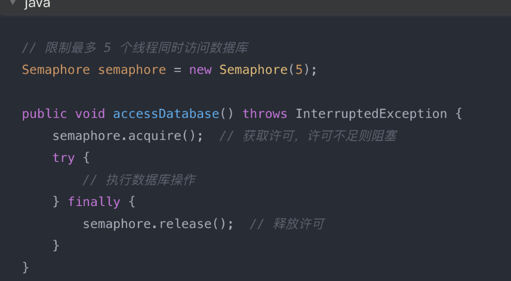
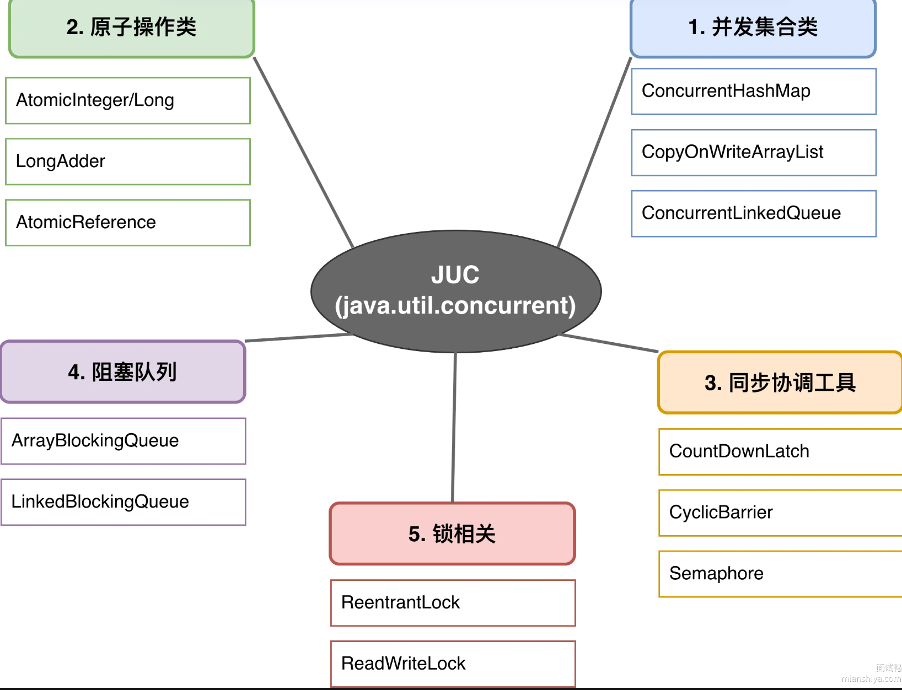

说说 AQS 吧？
- AQS全称AbstractQueuedSynchronizer，是JUC包里锁的同步器的基础框架，ReentrantLock，Semaphore，CountDownLatch,ReentrantReadWriteLock这些都是基于它实现的
- AQS的核心就两样：一个volatile int类型的state变量，一个双向链表实现的FIFO同步队列
- state表示资源状态，具体含义由子类定义，ReentrantLock里state表示锁被重入了多少次，Semaphore里state表示剩余多少许可， CountDownLatch里state表示还剩多少计数
- 线程想获取资源，先CAS改state，成功了就拿到资源，失败了就包装成Node节点加入队列尾部，然后park挂起等着，前面的线程释放资源后会unpark唤醒队列里的后续节点
- AQS把排队，阻塞，唤醒这些脏活都封装好了，子类只需要实现tryAcquire，tryRelease这几个方法，告诉AQS什么时候算拿到资源，什么时候算释放资源就行

什么是 Java 的 CountDownLatch?
- CountDownLatch是JUC中的一个倒计时门闩shuan，允许一个或多个线程等待其他线程完成操作后再继续执行，本质上就是一个计数器，初始值由构造函数指定，每调用一次countDown（）减1，减到0时所有调用await（）的线程被唤醒
- 典型场景：主线程需要等3个子任务都跑完才能汇总结果，创建 new CountDownLatch(3), 3个子线程分别执行任务，完成后调用countDown（），主线程调用await（）阻塞，直到计数器归零被唤醒

什么是 Java 的 CyclicBarrier?
- CyclicBarrier是一个循环屏障，允许一组线程互相等待，直到所有线程到达屏障点后再一起继续执行，和CountDownLatch的区别在于它可以重复使用，适合多轮同步的场景
- 比如有3个线程需要分阶段处理数据，每个阶段结束后必须等其他线程处理完才能进入下一阶段，第一个线程完成后调用await（）阻塞，第二个线程完成后也调用await（）阻塞，第三个线程调用await（）时计数器归零，三个线程同时被唤醒进入下一阶段，屏障自动重置

什么是 Java 的 Semaphore?
- Semaphore是Java并发包里的计数信号量，本质上维护了一个许可计数器，用来**控制同时访问某个资源的线程数量**，比如数据库连接池最多允许10个连接，就可以用new Semaphore（10）来限流
- 线程调用acquire（）时，如果许可数大于0，计数器减1，线程继续执行；如果许可数等于0，线程就会阻塞等待，线程完成任务后调用release（），计数器加1，同时唤醒一个等待的线程
- 底层实现依赖AQS，许可数就是AQS的state值，acquire（）对应AQS的共享式获取，通过CAS操作扣减state；release（）则是CAS增加state并唤醒等待队列中的线程

你使用过哪些 Java 并发工具类？

- 不用全说，讲项目里用过的，面试官大概率会追问实现原理，需提前准备