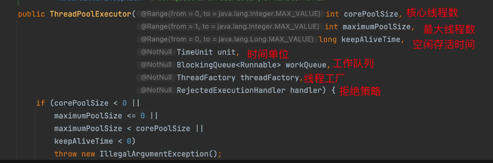
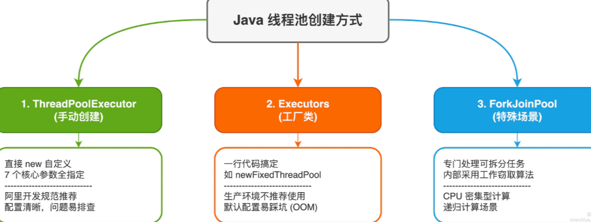
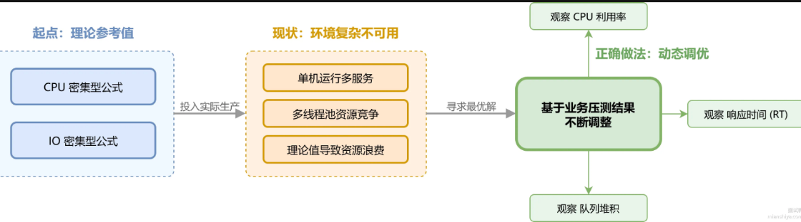
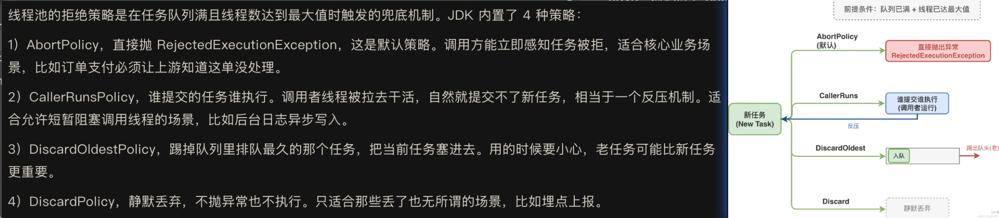
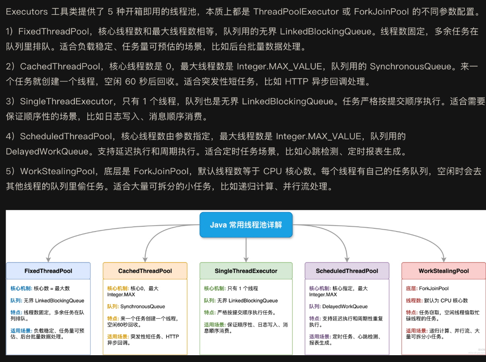
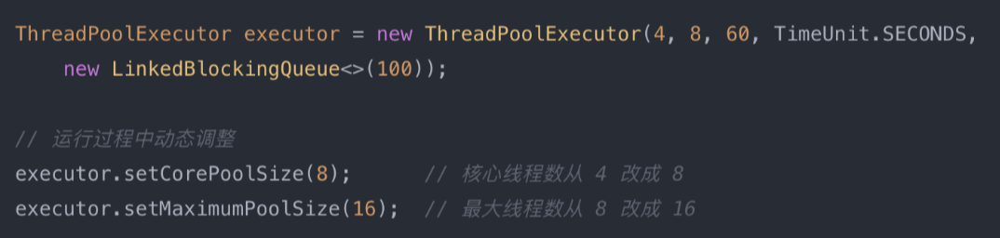
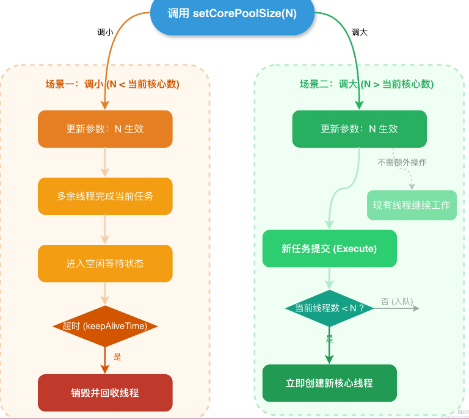

你了解 Java 线程池的原理吗？
- 线程池是一种池化技术，核心思想就是复用线程，避免每来一个任务就new一个Thread，创建销毁线程的开销不小，一个线程起码占用1MB左右的栈空间，还有操作系统层面的调度成本
- 线程池有几个关键参数：核心线程数、最大线程数、空间存活时间、工作队列、拒绝策略
- 工作流程是这样的：
1. 任务来了先看核心线程够不够用，不够就创建新线程处理。默认核心线程是懒创建的，有任务才new，不过可以通过prestartAllCoreThreads预热
2. 核心线程数满了之后，新任务不会立刻创建线程，而是先丢到工作队列里排队
3. 队列也塞满了，这时候才会创建非核心线程，最多创建到最大线程数
4. 队列满了、线程也到顶了，再来任务就触发拒绝策略
5. 线程空闲超过keepAliveTime，并且当前线程数超过核心线程数，多余的线程会被回收。设置allowCoreThreadTimeOut为true的话连核心线程也能回收

---

Java 创建线程池有哪些方式？
- ThreadPoolExecutor手动创建：直接new ThreadPoolExecutor，7个参数全部自己指定，这是阿里巴巴开发规范推荐的方式，因为你清楚的知道线程池的每个配置，出了问题好排查
- Executors工厂类：一行代码搞定，比如newFixedThreadPool，newCachedThreadPool，看着方便，但生产环境不推荐用，因为默认配置容易踩坑
- ForkJoinPool：专门用来跑可以拆分的并行任务，内部用工作窃取算法，适合CPU密集型的递归计算场景

---

如何合理地设置 Java 线程池的线程数？
- 线程数怎么设，关键看任务是CPU密集型还是IO密集型
- CPU密集型任务，比如加解密、压缩、复杂计算，CPU一直在干活，这时候线程开太多没意义，线程切换反而浪费时间，经验值是CPU核心数+1，多出来的1个是为了应对偶发的页缺失等中断
- IO密集型任务，比如读数据库、调远程接口、读接口，线程大部分时间在等IO返回，CPU闲着，这时候可以多开线程，让CPU在等待期间去处理其他任务，经验值是CPU核心数*2，甚至更多

---

Java 线程池有哪些拒绝策略？
- 线程池的拒绝策略是在任务队列满且线程数达到最大值时触发的兜底机制，JDK内置了4种策略：

---

Java 并发库中提供了哪些线程池实现？它们有什么区别？
- Executors工具类提供了5种开箱即用的线程池

---

Java 线程池核心线程数在运行过程中能修改吗？如何修改？
- 可以动态修改，ThreadPoolExecutor提供了setCorePoolSize（）和setMaximumPoolSize（）方法，能在线程池运行过程中调整核心线程数和最大线程数

- 调用setCorePoolSize（）后会立即生效，但有个细节要注意：
1. 如果新值比当前核心线程数大，线程池会在有新任务提交时逐步创建线程，直到达到新的核心线程数
2. 如果新值比当前核心线程数小，多出来的线程不会被立即销毁，而是等空闲超时后才会被回收
- 修改核心线程数的生效过程：
- 当调小核心线程数时，多余线程会在空闲超时后被逐步回收；当调大核心线程数时，新任务到来时会创建新线程直到达到目标数量

---

Java 线程池中 shutdown 与 shutdownNow 的区别是什么？

Java 线程池内部任务出异常后，如何知道是哪个线程出了异常？

什么是 Java 的 ForkJoinPool?

什么是 Java 的 CompletableFuture?

什么是 Java 的 Timer?

Java 中的 DelayQueue 和 ScheduledThreadPool 有什么区别？

你了解时间轮（Time Wheel）吗？有哪些应用场景？