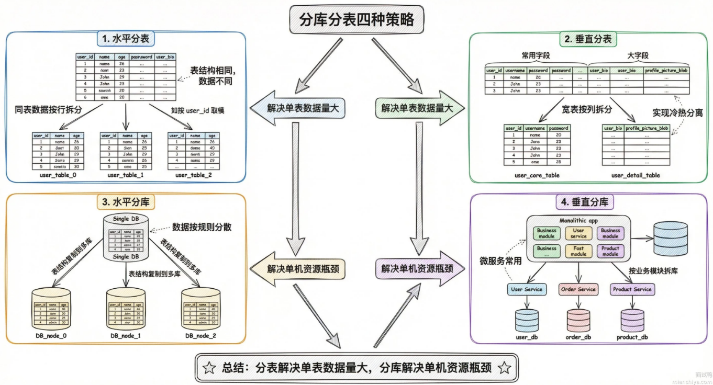

MySQL 是如何实现事务的
- 四个核心组件,Redo Log, Undo Log,锁,MVCC,它们分别对应事务ACID特性的不同方面
- 原子性-Atomicity 一致性-Consistency 隔离性-Isolation 持久性-Durability
- Redo(重做) Log保证**持久性(D)**,事务提交时,修改先写到redo log再写磁盘数据页,就算写数据页时宕机了,重启后通过重放redo log就能恢复数据,这就是经典的WAL机制
- Undo(回滚) Log保证**原子性(A)**,每次修改数据前,先把原值存到undo log里,事务回滚时,按undo log反向操作把数据恢复回去,要么全做完,要么全撤销,不会出现改一半的中间状态
- 锁机制(行锁,间隙锁等) 保证**隔离性(I)**,两个事务同时改同一行,必须等另一个释放锁,InnoDB的锁粒度精确到行级,还有间隙锁防止幻读
- MVCC保证隔离性的读写并发,读操作不加锁,通过undo log里的版本链找到自己应该看到的数据版本,写的时候别人照样能读,读的时候别人照样能写
- **一致性(C)** 不是单独实现的,它是原子性,隔离性,持久性共同作用的结果,数据从一个正确状态转移到另一个正确状态,中间不会出现不一致

MySQL 中的日志类型有哪些？binlog、redo log 和 undo log 的作用和区别是什么
- MySQL有三种核心日志: binlog 负责主从复制和数据恢复,redo log保证崩溃后数据不丢,undo log支持事务回滚和MVCC
- binlog是Server层的日志,记录的是逻辑操作,也就是原始SQL或者行变更前后的值,它的核心场景是主从同步,从库拉取主库的binlog重放一遍就能保持数据一致,另外做数据恢复的时候,也是靠binlog配合全量备份回放到指定时间点
- redo log是InnoDB引擎独有的,记录的是物理变更,具体就是某个数据页的某个偏移量改成了什么值,它的作用是crash-safe,MySQL挂了重启后,InnoDB会用redo log把没来得及刷盘的脏页恢复出来,redo log是循环写的,空间固定,写满了就得等checkpoint推进才能继续
- undo log 也是InnoDB的,记录的是数据修改前的旧值,事务回滚的时候,就靠undo log把数据改回去,另外MVCC的快照读也依赖它,别的事务要读历史版本,顺着undo log链往前找就行
- 三者本质区别:binlog记录的是数据变更的逻辑语义,由Server层生成,跨引擎通用,redo log和undo log服务于InnoDB的事务与恢复机制,强依赖引擎内部实现,只有InnoDB才有,binlog可以无限追加,redo log是循环覆盖写

什么是 Write-Ahead Logging (WAL) 技术？它的优点是什么？MySQL 中是否用到了 WAL
- WAL 的核心就是先写日志,再写数据,在真正修改数据之前,先把修改内容记录到日志文件里,这样即使数据库崩了,也能通过日志把数据恢复回来
- MySQL的InnoDB引擎的redo log就是WAL的典型实现
- 大致执行流程: 事务执行时(写内存) : 事务对是数据的修改,写入内存中的redo log buffer, 同时会直接更新内存中的Buffer Pool,使数据变成脏页; 事务提交时(写日志) : InnoDB将redo log buffer中的内容刷入磁盘的redo log文件,只要日志落盘成功,事务就算持久化完成,哪怕此时数据文件里的数据还是旧的; 后台刷脏(写数据): 内存中的脏页 (Buffer Pool), 会由后台线程在后续合适的时机,如系统空闲或 checkpoint 时异步刷入磁盘的数据文件

MySQL 插入一条 SQL 语句，redo log 记录的是什么
- redo log 是物理日志,记录的是某个数据页的某个偏移位置被改成了什么值, 而不是执行了什么SQL
- 插入一条记录时,redo log 记录的内容大致包括: 数据页的页号,比如Page 100 ; 页内偏移量, 比如从第50字节开始; 修改的长度, 比如20字节; 具体写入的数据内容; 页目录, 页头等元数据的变更
- 这么设计是因为恢复的时候不用走SQL解析和执行器那一套,直接把数据页的内容改回去就行,恢复速度快得多

MySQL 事务的二阶段提交是什么
- 二阶段提交是MySQL用来保证redo log和binlog数据一致性的机制,因为这两个日志分属不同层,一个是InnoDB引擎层,一个是Server层的,如果写入过程中宕机,就可能出现两边数据对不上的问题
-  两步走: Prepare阶段: 事务提交时,InnoDB先把修改写到redo log,但状态标记为prepare,表示我准备好了,但还没提交
-  Commit 阶段: redo log写完后,Server层把操作写到binlog,binlog落盘成功,再通知InnoDB把redo log状态改成commit,整个事务才算提交完成

MySQL 中的 MVCC 是什么
- 全称Multi-Version Concurrency Control,多版本并发控制,核心思想就是让读写操作互不阻塞
- 写操作修改数据时,MySQL不会立即覆盖原来数据,而是生成新版本的记录,每个记录都保留了对应版本号或时间戳,多版本之间串联起来形成了一条版本链
- 读操作(普通读)就可以无锁地根据事务启动时间去版本链上找到属于自己的那个版本,此时读写操作不会阻塞
- 具体实现是: InnoDB里每条记录都有两个隐藏字段
 1. trx_id记录最后修改这条数据的事务ID,也就是当前事务ID
 2. roll_pointer指向undo log的指针
- 每次UPDATE不会覆盖原数据,而是把旧值写到undo log里,新值写到数据页,roll_pointer指向旧版本,这样就串成了一条版本链
- 普通SELECT走的是快照读,不加锁,直接顺着版本链找到对自己可见的那个版本返回,写操作该怎么写怎么写,读写各走各的,并发性能拉满

MySQL 二级索引有 MVCC 快照吗
- 二级索引本身没有MVCC快照,原因是二级索引条条目只存了索引列值和主键值,不包含InnoDB的隐藏列trx_id和roll_ptr,没有这两个字段,就没法判断这条记录属于哪个事务版本,在undo log里往哪找历史版本
- 所以当二级索引项被修改或者打了删除标记时,InnoDB必须回表到聚簇索引,通过聚簇索引上的trx_id和undo log版本链来判断当前事务能看到哪个版本
- 一个容易踩的坑是: 即使你的查询走了覆盖索引,只要涉及版本判断,覆盖索引也会失效,还是得回表
- 不过也不是每次都会需要回表,二级索引每个页上记录了最后修改这个索引页的最大事务ID,当前事务启动时的最小活跃事务ID大于最大事务ID,则不用回表

如果 MySQL 中没有 MVCC，会有什么影响
- 没有MVCC的话,读写操作就得靠加锁来保证数据一致性,这套方案叫LBCC,Lock-Based Concurrency Control,读要等写完,写要等读完,系统吞吐量直接腰斩
- 具体来说,事务A正在改某条记录还没提交,事务B想读这条记录,因为没有历史版本可用,事务B只能干等着事务A提交或回滚,要是事务A执行时间长,事务B就一直卡着,高并发场景下锁竞争严重,性能基本废了
- MVCC的价值就在这:写操作产生新版本,读操作去版本链上找属于自己的那个版本,读写各走各的互不干扰,普通SELECT压根不加锁,并发能力拉满

MySQL 中的事务隔离级别有哪些
- 一共4种,隔离性从低到高分别是读未提交,读已提交,可重复读,串行化
- **读未提交 (READ UNCOMMITED, 脏读, 不可重复读, 幻读)**: 事务能看到别的事务还没提交的数据,等于毫无隔离性. 典型问题就是脏读,你读到的数据可能人家一会就回滚了,压根没落地
- **读已提交 (READ COMMITED, 不可重复读, 幻读)**: 只能看到别的事务已提交的数据,脏读问题没了,但同一个事务里两次查同一条数据,结果可能不一样,这就是不可重复读
- **可重复读 (REPEATABLE READ, 可能幻读)**: 事务开始后, 不管别的事务怎么改数据,你看到的永远是开始那一刻的快照. MySQL InnoDB默认就是这个级别,用MVCC实现,不过标准SQL定义里,这个级别还是会有幻读问题,就是两次范围查询返回的行数不一样
- **串行化 (SERIALIZABLE, 性能极差)**: 最严格的级别,相当于事务一个一个排队执行,等于把并发关了, InnoDB在这个级别下会把普通SELECT自动加上共享锁,能彻底杜绝所有并发问题,但是性能太差了

MySQL 默认的事务隔离级别是什么？为什么选择这个级别
- MySQL的默认事务隔离级别是可重复读(Repeatable Read) , 简称 RR

数据库的脏读、不可重复读和幻读分别是什么
- 这三个都是并发事务带来的数据一致性问题, 严重程度递减
- 脏读: 读到了别的事务还没提交的数据,万一那个数据回滚了,你读到的数据压根不存在,就像读了个 "脏数据"
- 不可重复读: 同一个事务里两次读同一行数据,结果不一样,因为中间有别的事务改了这行数据并提交了,强调的是数据内容变了
- 幻读: 同一个事物里两次执行同样的范围查询,返回的行数不一样,因为中间有别的事务插入或删除了符合条件的数据,强调的是数据行(数量)变了

MySQL 中有哪些锁类型
- MySQL InnoDB的锁可以从两个维度来分: 粒度和模式
- 粒度上分: 表锁和行锁, 表锁锁整张表, 行锁只锁具体的行,粒度越细并发越高
- 模式上分: 共享锁S锁和排他锁X锁1,S锁允许多个事务同时读,X锁独占,读写都不让别人碰
- 行锁又细分为三种,记录锁(单个)锁住具体一行,间隙锁(范围)锁住两条记录之间的空隙防止插入,临键锁是记录锁加间隙锁的组合
- 还有几个辅助性质的锁: 意向锁用来标记表里有没有行锁,加表锁不用遍历; 元数据锁MDL保护表结构, DDL和DML不能同时跑;插入意向锁表示有事务在等着往某个间隙锁插数据 

MySQL 的乐观锁和悲观锁是什么
- 乐观锁和悲观锁是两种并发控制思想,本质区别在于对冲突的预期态度不同,悲观锁是锁了再做,乐观锁是做了再锁
- 悲观锁假设冲突一定发生,所以操作数据前先把锁拿到,别的事务想动这条数据就得排队等着. MySQL里用SELECT ... FOR UPDATE拿排他锁,用SELECT ... LOCK IN SHARE MODE拿共享锁,拿到锁之后别的事务读写都会被阻塞,直到当前事务提交或回滚才释放,适用于写多冲突多的场景
- 乐观锁假设冲突很少发生,干脆不加锁,等真正更新的时候再检查数据有没有被别人改过. 通常用version字段来实现,读的时候把version一起读出来, 更新的时候在WHERE条件里带上这个version,如果version变了说明被别人改过,更新影响0行,业务层自己决定是重试还是报错,适合读多写少的场景

MySQL 中如果发生死锁应该如何解决
- 死锁后两种: 自动处理或者手动干预,推荐自动处理
- MySQL InnoDB自带死锁检测机制,由InnoDB_deadlock_detect参数控制,默认开启,一旦检测到死锁,存储引擎会自动选择一个代价最小的事务回滚掉,释放它持有的锁让另一个事务继续执行
- 另外还有个兜底机制是锁等待超时innodb_lock_wait_timeout,默认50秒,等锁超过这个时间就自动放弃并回滚
- 手动干预主要用在自动机制不够快或者需要立刻恢复的场景,先用show engine innodb status或者查INFORMATION_SECHEMA里的锁相关表找到阻塞的线程ID,然后`KILL<thread_id>`杀掉它

MySQL 中长事务可能会导致哪些问题
- 核心就是资源占用时间过长,影响整个系统的稳定性和性能
1. 锁竞争严重,容易引发连锁反应,持有锁,阻塞其他事务,持有锁时间长,阻塞其他事务,连接池被打满,上游服务超时,搞不好就雪崩了
2. 死锁风险增加, 事务执行时间越长,持有的锁越多,和其他事务产生循环等待的概率就越大
3. undo log膨胀, InnoDB的MVCC机制需要保留事务开始时的数据版本,长事务不提交,这个版本链就一直不能清理,一个跑了几小时的事务,磁盘空间告警,回滚段查询的性能也会变差
4. 主从延迟, 主库执行一个大事务要10分钟,binlog传到从库之后,从库要重放10分钟,这期间主从不一致,读从库的业务拿到的都是脏数据
5. 回滚代价大, 事务执行了这么久, 突然报错要回滚,之前的活白干,更惨的是回滚本身也要时间
