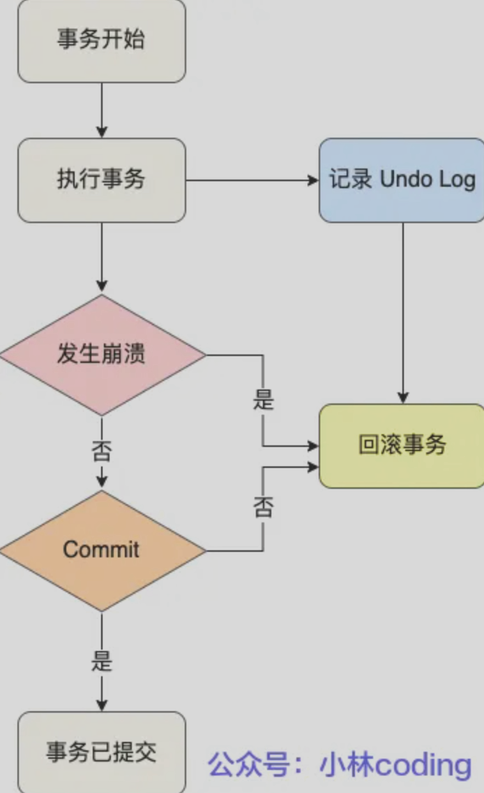
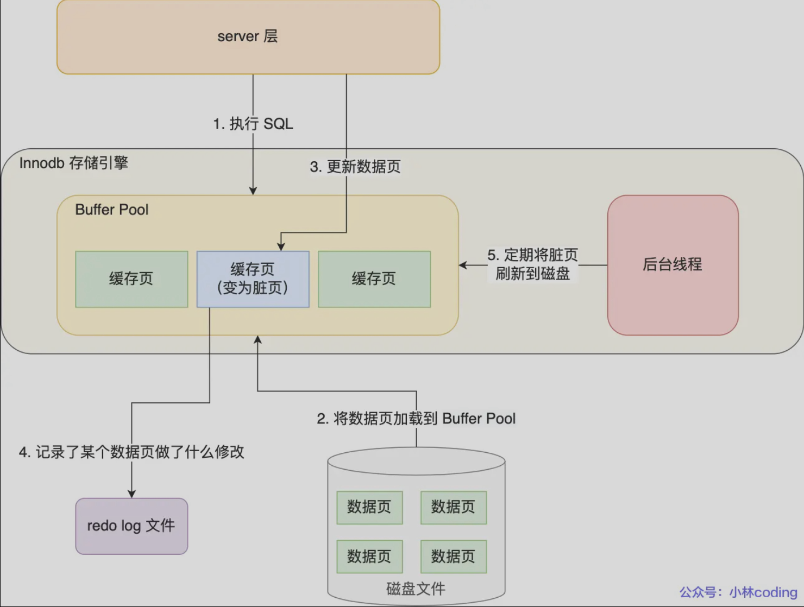
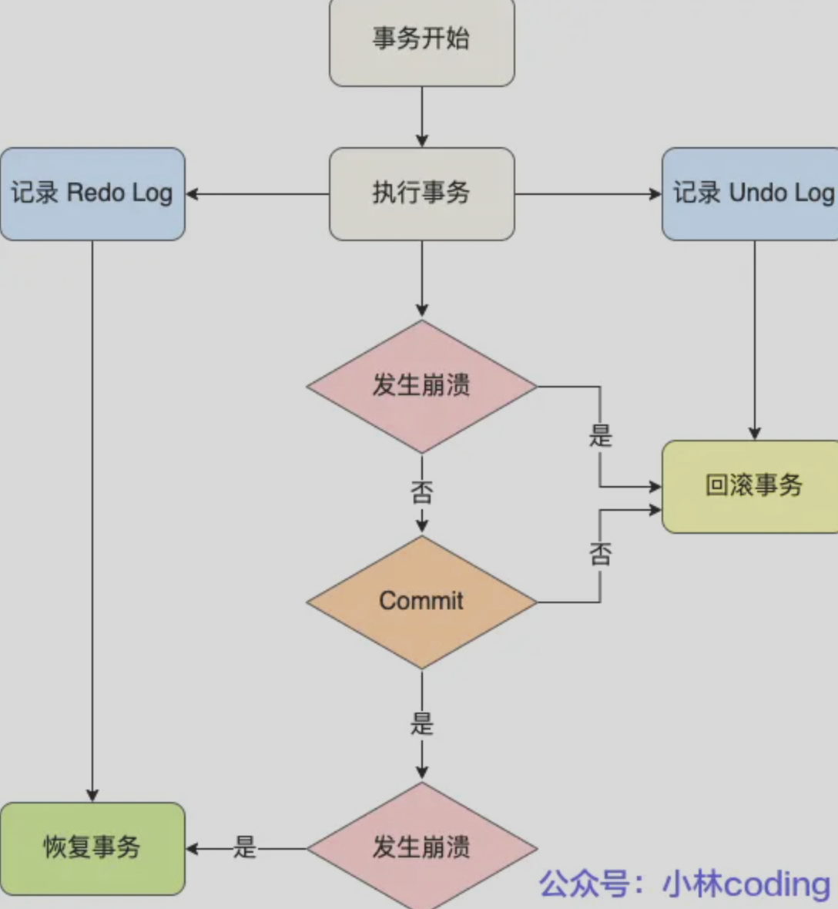
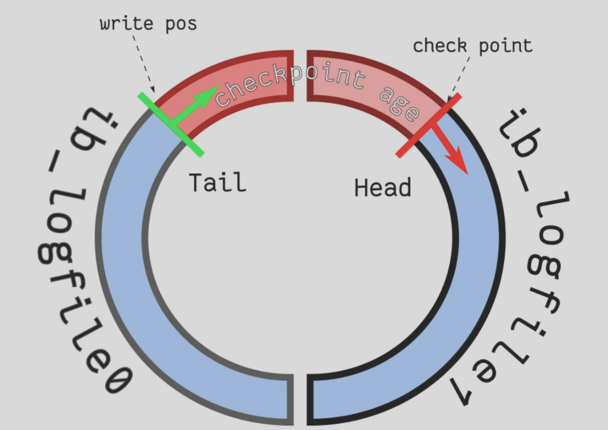
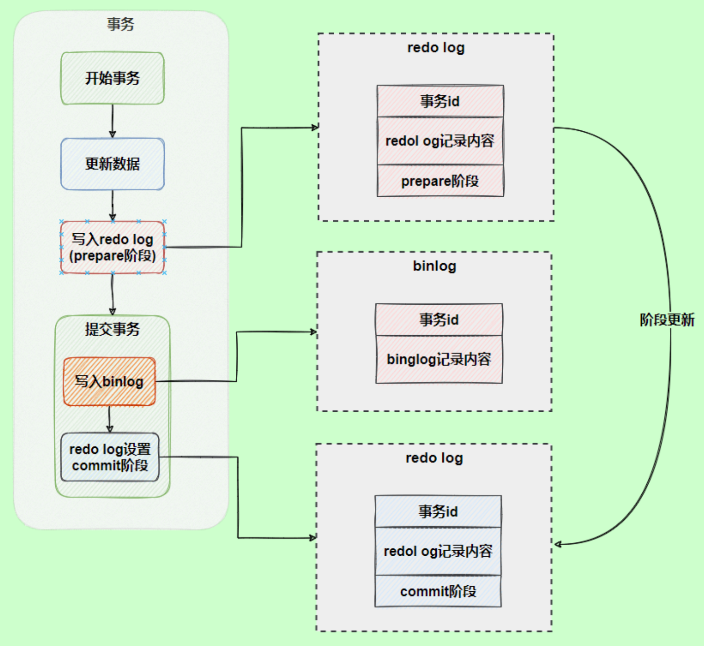

# MySQL日志：undo log、redo log、binlog
- undo log（回滚日志）：是 Innodb 存储引擎层生成的日志，实现了事务中的**原子性**，主要用于**事务回滚和 MVCC**。
- redo log（重做日志）：是 Innodb 存储引擎层生成的日志，实现了事务中的**持久性**，主要用于掉电等**故障恢复**；
- binlog（归档日志）：是 Server 层生成的日志，主要用于数据备份和主从复制；

### redo log 和 undo log 区别在哪？
这两种日志是属于 InnoDB 存储引擎的日志，它们的区别在于：
- redo log 记录了此次事务「**修改后**」的数据状态，记录的是更新之后的值，主要用于事务崩溃恢复，保证事务的持久性。
- undo log 记录了此次事务「**修改前**」的数据状态，记录的是更新之前的值，主要用于事务回滚，保证事务的原子性。

## undo log
考虑一个问题。一个事务在执行过程中，在还没有提交事务之前，如果 MySQL 发生了崩溃，要怎么回滚到事务之前的数据呢？

我们每次在事务执行过程中，都记录下回滚时需要的信息到一个日志里，那么在事务执行中途发生了 MySQL 崩溃后，我们可以通过这个日志回滚到事务之前的数据

undo log（回滚日志），它保证了事务的 ACID 特性中的原子性（Atomicity）。
undo log 是一种用于撤销回退的日志。在事务没提交之前，MySQL 会先记录更新前的数据到 undo log 日志文件里面
如下图

每当 InnoDB 引擎对一条记录进行操作（修改、删除、新增）时，要把回滚时需要的信息都记录到 undo log 里，比如：
- 在**插入**一条记录时，要把这条记录的主键值记下来，这样之后回滚时只需要把这个主键值对应的记录**删掉**就好了；
- 在**删除**一条记录时，要把这条记录中的内容都记下来，这样之后回滚时再把由这些内容组成的记录**插入**到表中就好了；
- 在**更新**一条记录时，要把被更新的列的旧值记下来，这样之后回滚时再把这些列**更新为旧值**就好了。

在发生回滚时，就读取 undo log 里的数据，然后做原先相反操作。比如当 delete 一条记录时，undo log 中会把记录中的内容都记下来，然后执行回滚操作的时候，就读取 undo log 里的数据，然后进行 insert 操作。

undo log 还有一个作用，通过 ReadView + undo log 实现 **MVCC**（多版本并发控制）。

## Buffer Pool

MySQL 的数据都是存在磁盘中的，那么我们要更新一条记录的时候，得先要从磁盘读取该记录，然后在内存中修改这条记录。那修改完这条记录是选择直接写回到磁盘，还是选择缓存起来呢？

当然是缓存起来好，这样下次有查询语句命中了这条记录，直接读取缓存中的记录，就不需要从磁盘获取数据了。

为此，Innodb 存储引擎设计了一个缓冲池（Buffer Pool），来提高数据库的读写性能。

有了 Buffer Pool 后：
当读取数据时，如果数据存在于 Buffer Pool 中，客户端就会直接读取 Buffer Pool 中的数据，否则再去磁盘中读取。

当修改数据时，如果数据存在于 Buffer Pool 中，那直接修改 Buffer Pool 中数据所在的页，然后将其页设置为脏页（该页的内存数据和磁盘上的数据已经不一致），为了减少磁盘 I/O，不会立即将脏页写入磁盘，后续由后台线程选择一个合适的时机将脏页写入到磁盘。

### Buffer Pool缓存什么
在 MySQL 启动的时候，InnoDB 会为 Buffer Pool 申请一片连续的内存空间，然后按照默认的 16KB 的大小划分出一个个的页，Buffer Pool 中的页就叫做**缓存页**

## Redo log
Buffer Pool 是基于内存的，而内存总是不可靠，万一断电重启，还没来得及落盘的脏页数据就会丢失

为了防止断电导致数据丢失的问题，当有一条记录需要更新的时候，InnoDB 引擎就会先更新内存（同时标记为脏页），然后将本次对这个页的修改以 redo log 的形式记录下来，这个时候更新就算完成了。

nnoDB 引擎会在适当的时候，由后台线程将缓存在 Buffer Pool 的脏页刷新到磁盘里，这就是 WAL（Write-Ahead Logging）技术
WAL：MySQL 的写操作并不是立刻写到磁盘上，而是先写日志，然后在合适的时间再写到磁盘上。

### 什么是 redo log?
redo log 是物理日志，记录了某个数据页做了什么修改，比如对 XXX 表空间中的 YYY 数据页 ZZZ 偏移量的地方做了 AAA 更新，每当执行一个事务就会产生这样的一条或者多条物理日志。

### redo log 要写到磁盘，数据也要写磁盘，为什么要多此一举？
写入 redo log 的方式使用了追加操作，所以磁盘操作是顺序写，而写入数据需要先找到写入位置，然后才写到磁盘，所以磁盘操作是随机写。

磁盘的「顺序写」比「随机写」高效得多，因此 redo log 写入磁盘的开销更小。

可以说这是 WAL 技术的另外一个优点：MySQL 的写操作从磁盘的「随机写」变成了「顺序写」，提升语句的执行性能。这是因为 MySQL 的写操作并不是立刻更新到磁盘上，而是先记录在日志上，然后在合适的时间再更新到磁盘上。

至此，针对为什么需要 redo log 这个问题我们有两个答案：
- 实现事务的持久性，让 MySQL 有 crash-safe 的能力，能够保证 MySQL 在任何时间段突然崩溃，重启后之前已提交的记录都不会丢失；
- 将写操作从「随机写」变成了「顺序写」，提升 MySQL 写入磁盘的性能。

### redo log 文件写满了怎么办？
如果 write pos 追上了 checkpoint，就意味着 redo log 文件满了，这时 MySQL 不能再执行新的更新操作，也就是说 MySQL 会被阻塞（因此所以针对并发量大的系统，适当设置 redo log 的文件大小非常重要），此时会停下来将 Buffer Pool 中的脏页刷新到磁盘中，然后标记 redo log 哪些记录可以被擦除，接着对旧的 redo log 记录进行擦除，等擦除完旧记录腾出了空间，checkpoint 就会往后移动（图中顺时针），然后 MySQL 恢复正常运行，继续执行新的更新操作。
所以，一次 checkpoint 的过程就是脏页刷新到磁盘中变成干净页，然后标记 redo log 哪些记录可以被覆盖的过程。

## 为什么需要 binlog ？
binlog 日志有三种格式，可以通过binlog_format参数指定。
- statement：记录的内容是SQL语句原文
- row：记录的内容不再是简单的SQL语句了，还包含操作的具体数据
- mixed：前两者的折中方案

MySQL 在完成一条更新操作后，Server 层还会生成一条 binlog，等之后事务提交的时候，会将该事务执行过程中产生的所有 binlog 统一写入 binlog 文件。

binlog 文件是记录了所有数据库表结构变更和表数据修改的日志，不会记录查询类的操作，比如 SELECT 和 SHOW 操作。

binlog 的写入时机也非常简单，事务执行过程中，先把日志写到binlog cache，事务提交的时候，再把binlog cache写到 binlog 文件中。

在执行更新语句过程，会记录 redo log 与 binlog 两块日志，以基本的事务为单位，redo log 在事务执行过程中可以不断写入，而 binlog 只有在提交事务时才写入，所以 redo log 与 binlog 的写入时机不一样。

为了解决两份日志之间的逻辑一致问题，InnoDB 存储引擎使用两阶段提交方案。

原理很简单，将 redo log 的写入拆成了两个步骤prepare和commit，这就是两阶段提交。

MySQL 数据库的数据备份、主备、主主、主从都离不开 binlog，需要依靠 binlog 来同步数据，保证数据一致性。

