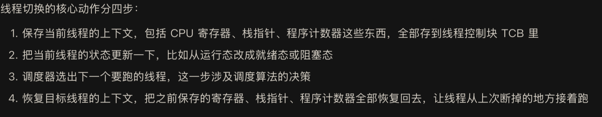
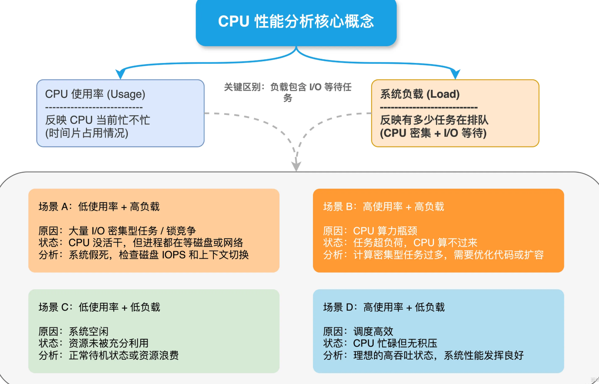
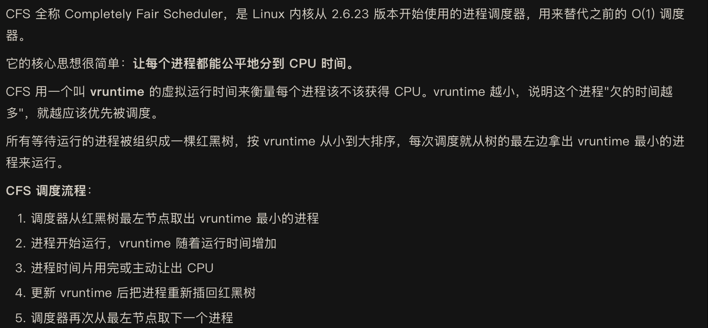
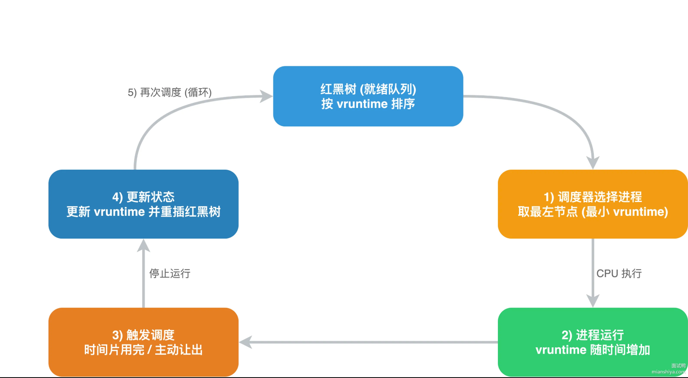

进程的调度算法你知道吗？

---

操作系统在进行线程切换时需要进行哪些动作？
线程切换就是把CPU的控制权从一个线程交给另一个线程，跟进程切换比起来，线程切换轻量很多
同一进程内的线程共享地址空间和资源，不需要切换页表

整个过程最耗时的是上下文保存和恢复，因为涉及大量寄存器的读写操作

---
CPU 使用率和 CPU 负载指的是什么？它们之间有什么关系？

--- 
听说过 CFS 吗？（Linux）

--- 
什么是 CPU 缓存一致性协议 MESI？
